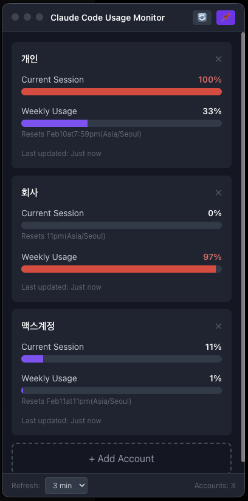

# Claude Code Usage Monitor

A desktop application for monitoring Claude Code usage in real-time across multiple accounts.


## Screenshot

<p align="center">
  
</p>

## Features

- **Multi-Account Support**: Monitor usage for multiple Claude Code accounts simultaneously
- **Real-Time Updates**: Auto-refresh at configurable intervals (1, 2, 3, or 5 minutes)
- **Visual Gauges**: Clear percentage bars for session and weekly usage
- **Desktop Widget**: Compact, always-on-top option for constant monitoring
- **System Tray**: Runs in background with quick access menu
- **Usage Alerts**: Notifications at 80%, 90%, and 100% usage thresholds
- **Reset Time Display**: Shows when session and weekly limits reset

## Requirements

- [Claude Code CLI](https://claude.ai/code) installed and logged in
- Node.js 18+
- npm or yarn

## Installation

```bash
# Clone the repository
git clone https://github.com/neoescape/claudeCode_Usage_monitor_electron.git
cd claudeCode_Usage_monitor_electron

# Install dependencies
npm install

# Run in development mode
npm run dev
```

## Building Installers

### Prerequisites

Place icon files in the `build/` directory (see `build/README.md` for details).

### Build Commands

```bash
# Build for macOS
npm run build:mac

# Build for Windows
npm run build:win

# Build for Linux
npm run build:linux
```

Output files will be in the `release/` directory.

## Usage

### Adding an Account

1. Click **"+ Add Account"** button
2. Enter a name for the account (e.g., "Personal", "Work")
3. Choose one of the following:
   - **Use existing account**: Uses your default `~/.claude` configuration
   - **Add new account**: Creates a separate config directory for a different Claude account

### Multiple Accounts

To use multiple Claude accounts, each account needs its own configuration directory:

```bash
# For the second account, run Claude CLI with a custom config directory
CLAUDE_CONFIG_DIR=~/.claude-work claude

# Login to your second account in the browser
# The app will automatically use this config for the "Work" account
```

### Settings

- **Refresh Interval**: Choose between 1, 2, 3, or 5 minute intervals
- **Always on Top**: Pin the window above other applications
- **System Tray**: Access quick actions from the menu bar

## Tech Stack

- **Electron** - Cross-platform desktop framework
- **React** - UI library
- **TypeScript** - Type safety
- **Tailwind CSS** - Styling
- **node-pty** - Terminal emulation for CLI interaction
- **electron-vite** - Build tool

## How It Works

The app uses `node-pty` to spawn the Claude CLI process and automatically:

1. Navigates through initial setup prompts (theme, login, security notes, etc.)
2. Sends the `/usage` command
3. Parses the ANSI output to extract usage percentages
4. Updates the UI with the fetched data

This approach works without requiring API tokens, using the same authentication as your Claude Code CLI.

## Project Structure

```
src/
├── main/               # Electron main process
│   ├── index.ts        # App entry, window management
│   ├── claude-cli.ts   # CLI interaction logic
│   ├── scheduler.ts    # Auto-refresh scheduler
│   ├── store.ts        # Settings persistence
│   └── types.ts        # TypeScript types
├── preload/            # Electron preload scripts
│   └── index.ts        # IPC bridge
└── renderer/           # React frontend
    └── src/
        ├── App.tsx
        └── components/
            ├── AccountCard.tsx
            ├── AddAccountModal.tsx
            ├── SettingsPanel.tsx
            └── UsageGauge.tsx
```

## Development

```bash
# Run in development mode with hot reload
npm run dev

# Build application
npm run build

# Preview built application
npm run preview
```

## Troubleshooting

### "Failed to parse usage data"

This usually means the Claude CLI couldn't complete the login flow. Try:

1. Run `claude` in terminal to ensure you're logged in
2. Complete any pending prompts (theme selection, security notes, etc.)
3. Refresh the app

### Data takes time to load

Initial data fetch can take 15-30 seconds as the app navigates through CLI prompts. A loading indicator will be displayed during this time.

### Native module errors

If you see errors about `node-pty`, rebuild the native modules:

```bash
npm run postinstall
# or
npx electron-rebuild -f -w node-pty
```

## Platform Notes

### Windows

On Windows, ensure Claude CLI is installed and accessible. The app will look for:
- `%LOCALAPPDATA%\Programs\claude\claude.exe`
- `%APPDATA%\npm\claude.cmd`
- `claude` in PATH

### Linux

On Linux, the app creates `.deb` and `.AppImage` packages. Ensure Claude CLI is installed at:
- `~/.local/bin/claude`
- `/usr/local/bin/claude`

## License

MIT

## Acknowledgments

- [Claude Code](https://claude.ai/code) by Anthropic
- Built with [Electron](https://www.electronjs.org/)
